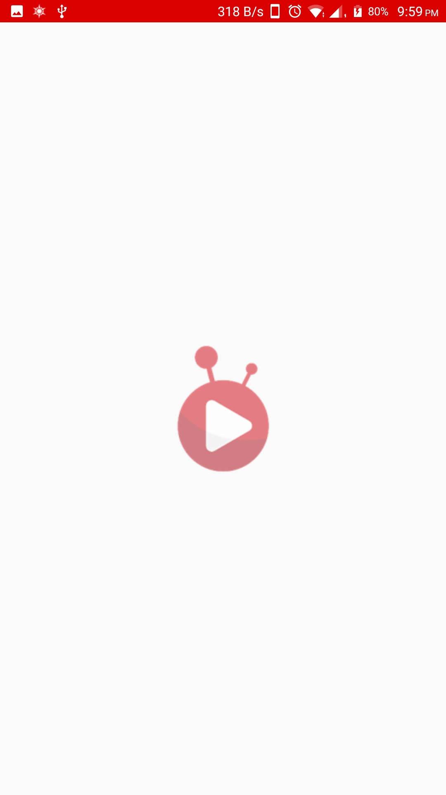
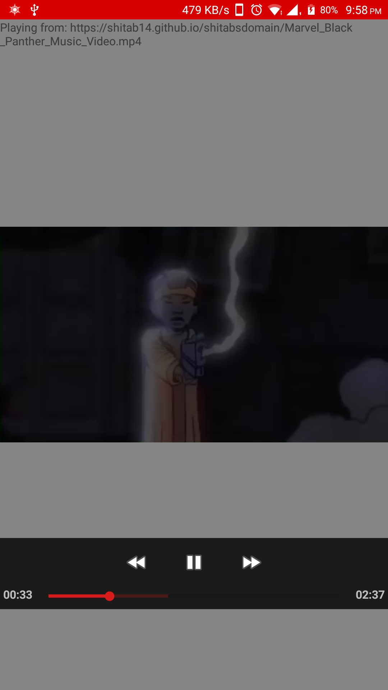
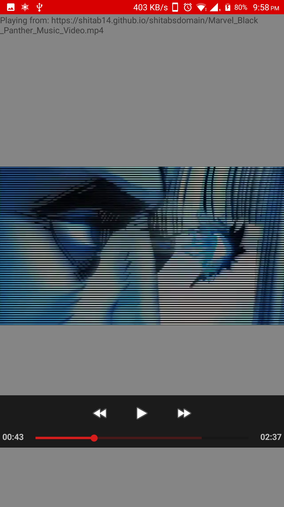

# VideoPlayerDemo
Demo Video player Android project

GitHub Link: https://github.com/shitab14/VideoPlayerDemo 

This is the video player/ streaming application with ‘Play’, ‘Forward’, and ‘Rewind’ functionalities. As design pattern for the player, I have used the default MediaController for the ‘Play’, ‘Forward’ and ‘Rewind’ functionalities. This is a default object given for VideoView to use, customizable yet lightweight in aspect of memory, and reduces code, time and effort.
Although it is the best if MediaController is custom made for streaming businesses such as Netflix or Amazon Prime content but in this project, I have demonstrated an easy practice. 
(This app streams a video content from my Git server which will use Internet on your Android Device. You will find the apk of the app in APK folder in the given link.)
